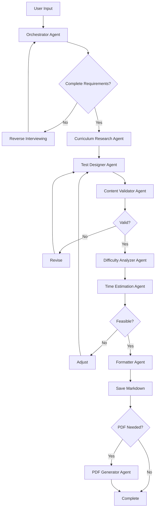

# Educational Test Creator 🎓

An AI-powered educational test creation system using **Claude** with 9 specialized agents to generate curriculum-aligned assessments for children ages 6-19.

## Overview

This system creates high-quality educational tests for multiple education systems (Germany, USA, UK) with professional Markdown and PDF outputs. It uses a sophisticated multi-agent workflow to ensure accuracy, age-appropriateness, and curriculum alignment.

**Key Innovation:** Automated multi-agent workflow with intelligent curriculum fetching and comprehensive quality validation.

## Features

- **9 Specialized AI Agents** working in coordinated workflow
- **Automated Workflows**: Complete test creation from curriculum to PDF
- **Multi-Country Support**: Germany (16 states), USA (50 states), UK (4 nations)
- **10+ Question Types**: Multiple choice, fill-in-blanks, matching, ordering, short answer, and more
- **Automatic Curriculum Fetching**: Uses WebFetch to retrieve from official education websites
- **Quality Validation**: 5-dimension quality checks (accuracy, clarity, bias, age-appropriateness, alignment)
- **Difficulty Analysis**: Automated 0-10 scoring with balanced distribution (30% easy, 50% medium, 20% hard)
- **Time Estimation**: Calculates completion time for different skill levels
- **Professional PDFs**: Student versions + answer keys with customizable themes
- **Bloom's Taxonomy**: Aligned question distribution across cognitive levels
- **Comprehensive Audit Trails**: Complete workflow reports for every test generation

---

## Directory Structure

```
create_tests_claude/
├── specs/                      # Agent specifications and workflow documentation
│   ├── agents/                 # Individual agent definitions
│   │   ├── orchestrator-agent.md
│   │   ├── curriculum-fetcher-agent.md
│   │   ├── test-designer-agent.md
│   │   └── ... (9 total agents)
│   ├── main-spec.md
│   ├── agent-collaboration.md
│   └── implementation-guide.md
├── data/
│   └── curriculum/             # Curriculum YAML files
│       ├── germany/            # By country/region/school/subject/grade
│       ├── usa/
│       └── uk/
├── tests/                      # Generated Markdown test files
├── pdfs/                       # Generated PDF files
│   ├── student_versions/
│   └── answer_keys/
├── .agent_workspace/           # Agent intermediate outputs (gitignored)
│   ├── curriculum_research/
│   ├── test_drafts/
│   ├── validation_reports/
│   ├── difficulty_analysis/
│   ├── time_estimates/
│   ├── reports/                # Workflow execution reports (NEW)
│   └── orchestrator_logs/
├── templates/                  # LaTeX templates for PDF generation
├── specs/                      # Complete specification documentation
└── README.md
```

## Quick Start

### Prerequisites

- **Claude** (API or desktop app) with access to tools and file operations
- **Python 3.8+** for workflow automation scripts
- **Pandoc** (for PDF generation): `brew install pandoc`
- **LaTeX** (for PDF generation): `brew install --cask basictex` or `brew install mactex`

### Installation

1. **Clone the repository:**
   ```bash
   git clone https://github.com/yourusername/create_tests_claude.git
   cd create_tests_claude
   ```

2. **Verify setup:**
   ```bash
   # Verify Pandoc installation (optional, for PDF output)
   pandoc --version
   pdflatex --version

   # Check repository structure
   ls specs/agents/
   ```

3. **Start creating tests:**
   - Open this repository in Claude (desktop or API)
   - Describe your test requirements in natural language
   - Claude will orchestrate all 9 agents to create your test
   - Review outputs in `tests/` and `pdfs/` directories

## Usage

### Creating a Test

**Natural language request (Recommended):**
```
Create a 45-minute test for Gymnasium Niedersachsen, Grade 6, English, topic: Present Simple vs Past Progressive
```

Claude will automatically orchestrate all agents and guide you through any missing information.

**Specific workflow requests:**
```
Fetch the curriculum for Grade 6 Biology in Niedersachsen
Validate the existing test in tests/germany/niedersachsen/gymnasium/deutsch/klasse_6/
Generate a PDF for the markdown test file at [path]
Analyze the difficulty distribution of this test
```

### Agent Workflow

The system uses 9 agents in sequence:

1. **Orchestrator** - Coordinates workflow, gathers requirements, **generates workflow reports**
2. **Curriculum Fetcher** - Automatically fetches curriculum from official sources
3. **Curriculum Researcher** - Reads curriculum YAML, extracts learning objectives
4. **Test Designer** - Generates questions aligned with curriculum
5. **Content Validator** - Validates accuracy, bias, clarity
6. **Difficulty Analyzer** - Assesses difficulty distribution
7. **Time Estimator** - Calculates completion time
8. **Formatter** - Applies final Markdown formatting
9. **PDF Generator** - Creates student + answer key PDFs

**Workflow Reports**  
Every test creation generates a comprehensive workflow report documenting all agent steps, decisions, and metrics. Reports are stored in `.agent_workspace/reports/` and provide:
- Complete audit trail of all 9 agent steps
- Quality metrics and validation results
- File paths to all generated outputs
- Timing and performance data
- Recommendations for educators

### Output Files

**Markdown Test:**
```
tests/germany/niedersachsen/gymnasium/englisch/grade_6/present_simple_vs_past_progressive/klassenarbeit.md
```

**PDF Files:**
```
pdfs/student_versions/Englisch_PresentSimple_Grade6_Student.pdf
pdfs/answer_keys/Englisch_PresentSimple_Grade6_Key.pdf
```

**Workflow Report:** ⭐ NEW
```
.agent_workspace/reports/de-ns-gym-eng-6-tenses-001_run_2025-11-15T14-00-00.md
```

**Intermediate Files** (in `.agent_workspace/`, gitignored):
- Curriculum research YAML
- Test drafts (versions)
- Validation reports
- Difficulty analysis
- Time estimates
- Workflow execution reports

## Curriculum Management

### Using Existing Curriculum

Curriculum files are organized by country/region/school/subject/grade:
```
data/curriculum/germany/niedersachsen/gymnasium/englisch/grade_6.yaml
```

### Fetching New Curriculum

Fetch curriculum using the slash command or natural request:
```
/fetch-curriculum
```
Or:
```
Fetch curriculum for Bayern Gymnasium Grade 8 Mathematics
```

Supports:
- **Germany**: Official Kerncurriculum websites for all 16 states
- **USA**: Common Core, NGSS, state standards
- **UK**: National Curriculum for England/Scotland/Wales/Northern Ireland

**⚠️ CRITICAL:** Curriculum is ALWAYS fetched from official government sources using WebFetch, never created from AI knowledge.

## Quality Standards

### Validation Thresholds
- **Factual Accuracy**: 100%
- **Age-Appropriateness**: 95%
- **Clarity**: 90%
- **Bias-Free**: 100%
- **Curriculum Alignment**: 100%

### Difficulty Distribution
- **Easy (⭐)**: 30% (±10%)
- **Medium (⭐⭐)**: 50% (±10%)
- **Hard (⭐⭐⭐)**: 20% (±10%)

### Bloom's Taxonomy
- **Remember/Understand**: 40%
- **Apply/Analyze**: 40%
- **Evaluate/Create**: 20%

## Question Types

1. Multiple Choice
2. True/False
3. Fill-in-the-Blanks
4. Matching
5. Ordering/Sequencing
6. Short Answer
7. Multiple Select
8. Drag-and-Drop (description-based)
9. Image-based Questions
10. Scenario-based Questions

## Regional Specifications

### Germany
- **Language**: German (formal "Sie" for Gymnasium, informal "du" for Grundschule)
- **Grading**: 1-6 scale (1=Sehr gut, 6=Ungenügend)
- **Notation**: Decimal comma (3,14), thousands dot (1.000)

### USA
- **Language**: English
- **Grading**: A-F or percentage-based
- **Standards**: Common Core, NGSS, state-specific

### UK
- **Language**: British English
- **Grading**: Key Stages, GCSE grades
- **Standards**: National Curriculum variations

## Development

### Agent Architecture

**Hybrid Approach:**
- **Orchestrator** coordinates via Task tool
- **Specialized Agents** launched as needed for specific tasks
- **Slash Commands** for manual workflow control

**Claude Code Tools Used:**
- **Task** - Launch specialized agents
- **Read/Write/Edit** - File operations
- **WebFetch** - Retrieve curriculum from official sources
- **Grep/Glob** - Search and find files
- **Bash** - Shell operations (git, pandoc)
- **AskUserQuestion** - Interactive requirements gathering
- **TodoWrite** - Track workflow progress

### Customizing Agents

1. Modify agent definitions in `.claude/agents/`
2. Update slash commands in `.claude/commands/`
3. Test with: `/create-test`
4. Check intermediate outputs in `.agent_workspace/`
5. Validate final test meets quality thresholds

---


---

13. **[Agent Collaboration Protocol](./specs/agent-collaboration.md)** - Inter-agent communication and reverse interviewing
14. **[Implementation Guide](./specs/implementation-guide.md)** - Phased implementation checklist
15. **[Success Metrics](./specs/success-metrics.md)** - Quality indicators and performance metrics
16. **[Data Schemas](./specs/data-schemas.md)** - File formats, templates, and communication protocols
17. **[GitHub Copilot Customization](./specs/github-copilot-customization.md)** - Custom instructions, prompt files, and agents
18. **[Implementation Decisions](./specs/implementation-decisions.md)** - Critical technical decisions

---

## Contributing

1. Fork the repository
2. Create a feature branch: `git checkout -b feature/new-question-type`
3. Make changes and test with agent workflow
4. Commit: `git commit -am 'Add new question type'`
5. Push: `git push origin feature/new-question-type`
6. Create Pull Request

## License

MIT License - See LICENSE file for details

## Acknowledgments

- Built with **Claude Code** by Anthropic
- Powered by **Claude Sonnet 4.5** for intelligent agent orchestration
- PDF generation via **Pandoc** and **LaTeX**
- Curriculum sources: Official education ministry websites

## Support

For issues, questions, or feature requests, please open an issue on GitHub.

---

**Created with ❤️ for teachers and educators**

*Version 1.0.0 - November 2025*

---

## Quick Start

1. Review the [Main Specification](./specs/main-spec.md) for project overview
2. Check [Agent Specifications](./specs/agents/) for individual agent capabilities
3. Follow the [Implementation Guide](./specs/implementation-guide.md) for development phases

---

## Agent Workflow Overview



---

## Key Features

✅ **Multi-format questions** (10+ question types)  
✅ **International curriculum support** (Germany, USA, UK, and more)  
✅ **Intelligent agents** with reverse interviewing capability  
✅ **Time-feasible tests** with automatic validation  
✅ **Professional PDFs** with multiple styling themes  
✅ **Organized repository** with hierarchical structure  
✅ **Quality assurance** at every step  
✅ **Gamification** elements for engagement  
✅ **Workflow reports** for complete transparency and auditability ⭐ NEW  

---

---

## Documentation Structure


