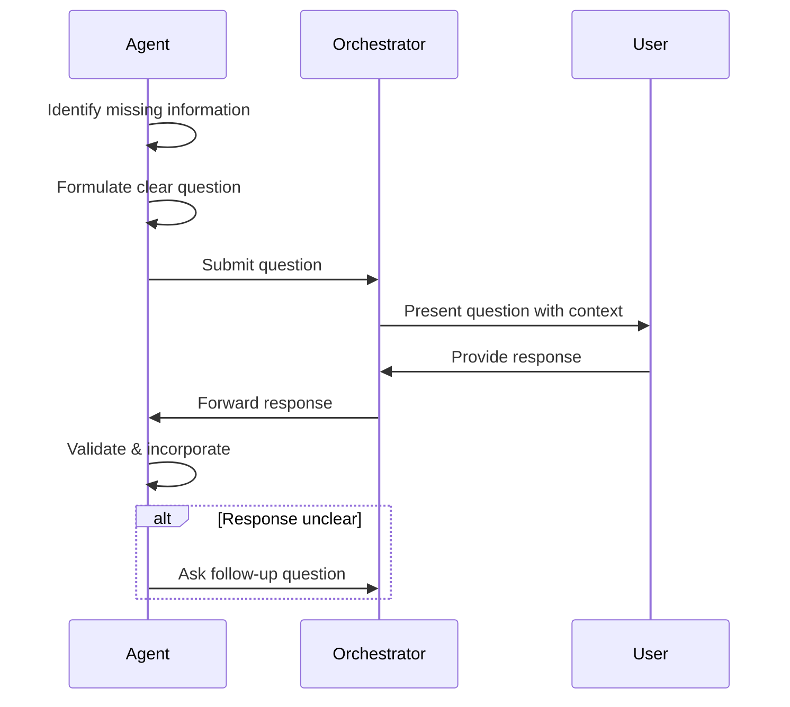
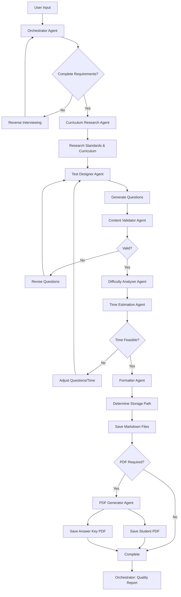

# Agent Collaboration & Communication Protocol

[← Back to Documentation Index](../README.md)

---

## Overview

This document defines how agents communicate, coordinate, and collaborate throughout the test creation workflow.

---

## 1. Reverse Interviewing Protocol

### 1.1 Purpose

Allow agents to gather missing information rather than making assumptions, ensuring high-quality, accurate test creation.

### 1.2 When to Use

- Critical information is missing
- Ambiguity exists in requirements
- Multiple valid options exist
- User preference would significantly impact output

### 1.3 How It Works



### 1.4 Question Format

```
[Agent Name] needs clarification:

Question: [Clear, specific question]

Context: [Why this information is needed]

Options (if applicable):
1. [Option 1] - [Brief description]
2. [Option 2] - [Brief description]
3. [Option 3] - [Brief description]

Current assumption: [What agent will assume if no answer provided]
```

### 1.5 Example

```
Curriculum Research Agent needs clarification:

Question: Which Bundesland in Germany should this test align with?

Context: Different Bundesländer have different curricula for Gymnasium 
Klasse 7 Mathematics. This affects the specific topics and depth required.

Options:
1. Bayern - Lehrplan PLUS (competency-based, modern approach)
2. Nordrhein-Westfalen - Kernlehrpläne (comprehensive coverage)
3. Baden-Württemberg - Bildungspläne (traditional structure)
4. Other - [Please specify]

Current assumption: If not specified, will use general German KMK standards
```

### 1.6 Best Practices

- Ask one question at a time when possible
- Provide sensible defaults
- Explain impact of different choices
- Keep questions focused and specific
- Limit to 3-5 questions per agent per workflow
- Batch related questions together

---

## 2. Agent Workflow

### 2.1 Complete Workflow Diagram



### 2.2 Phase Breakdown

#### Phase 1: Requirements Gathering
**Primary Agent:** Orchestrator Agent  
**Activities:**
- Parse initial user request
- Identify missing information
- Conduct reverse interviewing
- Validate and confirm requirements

#### Phase 2: Curriculum Research
**Primary Agent:** Curriculum Research Agent  
**Activities:**
- Research official curriculum documents
- Extract learning objectives
- Determine appropriate complexity
- Provide regional specifications

#### Phase 3: Test Design
**Primary Agent:** Test Designer Agent  
**Activities:**
- Generate questions using diverse formats
- Align with learning objectives
- Include gamification elements
- Create answer keys

#### Phase 4: Validation Loop
**Primary Agent:** Content Validator Agent  
**Activities:**
- Check factual accuracy
- Verify age-appropriateness
- Ensure clarity
- Detect bias
- Validate curriculum alignment

#### Phase 5: Difficulty Analysis
**Primary Agent:** Difficulty Analyzer Agent  
**Activities:**
- Assess question difficulty
- Balance distribution
- Suggest adjustments

#### Phase 6: Time Estimation
**Primary Agent:** Time Estimation Agent  
**Activities:**
- Calculate time requirements
- Validate feasibility
- Recommend adjustments if needed

#### Phase 7: Formatting
**Primary Agent:** Formatter Agent  
**Activities:**
- Apply consistent Markdown formatting
- Add visual elements
- Structure sections
- Validate syntax

#### Phase 8: File Storage
**Primary Agent:** Orchestrator Agent  
**Activities:**
- Determine storage path
- Save Markdown files
- Update metadata index

#### Phase 9: PDF Generation (Optional)
**Primary Agent:** PDF Generator Agent  
**Activities:**
- Convert Markdown to PDF
- Apply styling theme
- Generate student and answer key versions
- Save PDF files

---

## 3. Inter-Agent Communication

### 3.1 Data Exchange Format

Agents exchange data using structured YAML/JSON:

```yaml
agent_communication:
  from_agent: "Curriculum Research Agent"
  to_agent: "Test Designer Agent"
  timestamp: "2025-11-15T10:30:00Z"
  
  data:
    learning_objectives:
      - "Solve linear equations"
      - "Apply equivalence transformations"
    
    vocabulary_level: "Grade 7 German"
    difficulty_range: "Medium to Advanced"
    
    regional_specifics:
      country: "Germany"
      bundesland: "Bayern"
      curriculum: "Lehrplan PLUS"
    
    terminology:
      equation: "Gleichung"
      variable: "Variable"
      solve: "Lösen"
```

### 3.2 Status Updates

Agents report progress to the Orchestrator:

```yaml
status_update:
  agent: "Test Designer Agent"
  phase: "Test Design"
  status: "IN_PROGRESS"
  progress: 60
  message: "Generated 6 of 10 questions"
  eta_seconds: 45
```

### 3.3 Error Reporting

```yaml
error_report:
  agent: "Content Validator Agent"
  severity: "CRITICAL"
  issue: "Factual error detected in Question 3"
  details: "The capital of France is Paris, not Lyon"
  recommended_action: "Revise question or replace"
  requires_user_input: false
```

---

## 4. Quality Gates

### 4.1 Gate Definitions

Quality gates are checkpoints that must be passed before proceeding:

**Gate 1: Requirements Complete**
- All critical fields populated
- User has confirmed requirements
- Curriculum source identified

**Gate 2: Curriculum Alignment**
- Learning objectives identified
- Standards referenced
- Regional specifications clear

**Gate 3: Content Validation**
- All questions factually accurate
- No bias detected
- Age-appropriate language

**Gate 4: Difficulty Balance**
- Distribution matches target
- Appropriate for school type
- Suitable challenge level

**Gate 5: Time Feasibility**
- Estimated time within limits
- Concentration span appropriate
- Time per question reasonable

**Gate 6: Format Compliance**
- Valid Markdown syntax
- Consistent structure
- Complete metadata

**Gate 7: Final Approval**
- All gates passed
- User confirmation (if needed)
- Ready for output

### 4.2 Gate Enforcement

```python
def check_quality_gate(gate_name, gate_criteria):
    """
    Verify quality gate criteria are met
    """
    results = []
    for criterion in gate_criteria:
        result = evaluate_criterion(criterion)
        results.append(result)
    
    if all(results):
        return {
            'gate': gate_name,
            'status': 'PASSED',
            'timestamp': get_timestamp()
        }
    else:
        failed = [c for c, r in zip(gate_criteria, results) if not r]
        return {
            'gate': gate_name,
            'status': 'FAILED',
            'failed_criteria': failed,
            'action': 'RETRY_OR_ESCALATE'
        }
```

---

## 5. Coordination Strategies

### 5.1 Sequential Processing

Most agents work sequentially (one after another):
- Curriculum Research → Test Designer
- Test Designer → Content Validator
- Difficulty Analyzer → Time Estimator

### 5.2 Iterative Loops

Some phases may repeat until quality criteria met:
- Test Designer ↔ Content Validator (until valid)
- Difficulty Analyzer ↔ Test Designer (until balanced)

### 5.3 Parallel Processing (Future Enhancement)

Potential parallel operations:
- Generate multiple question variants simultaneously
- Create Markdown and PDF concurrently
- Validate different aspects in parallel

---

## 6. Conflict Resolution

### 6.1 Conflicting Requirements

**Example:** Time estimate exceeds target duration

**Resolution:**
1. Time Estimator flags issue
2. Orchestrator evaluates options:
   - Reduce question count
   - Simplify questions
   - Extend time limit
   - Split into multiple tests
3. User input requested if needed
4. Orchestrator decides and instructs agents

### 6.2 Validation Failures

**Example:** Content Validator finds errors

**Resolution:**
1. Validator provides specific feedback
2. Test Designer revises
3. Validation repeated
4. Maximum 3 iterations before escalation

---

## 7. Logging & Traceability

### 7.1 Activity Log

All agent activities logged for transparency:

```yaml
activity_log:
  - timestamp: "2025-11-15T10:30:00Z"
    agent: "Orchestrator"
    action: "Initiated workflow"
    user_request: "Create math test for Grade 7"
  
  - timestamp: "2025-11-15T10:30:15Z"
    agent: "Orchestrator"
    action: "Reverse interviewing"
    question: "Which Bundesland?"
  
  - timestamp: "2025-11-15T10:31:00Z"
    agent: "Curriculum Research"
    action: "Research started"
    parameters: {bundesland: "Bayern"}
```

### 7.2 Decision Trail

Track key decisions made during workflow:

```yaml
decisions:
  - decision_id: 1
    timestamp: "2025-11-15T10:32:00Z"
    agent: "Orchestrator"
    decision: "Use Bayern curriculum"
    rationale: "User specified Bayern"
    impact: "High"
  
  - decision_id: 2
    timestamp: "2025-11-15T10:35:00Z"
    agent: "Difficulty Analyzer"
    decision: "Adjust Q5 from Hard to Medium"
    rationale: "Distribution 40% hard (target 20%)"
    impact: "Medium"
```

---

## Related Documentation

- [Orchestrator Agent](./agents/orchestrator-agent.md)
- [All Agent Specifications](./agents/)
- [Main Specifications](./main-spec.md)
- [Success Metrics](./success-metrics.md)

---

**Version:** 2.0  
**Last Updated:** November 15, 2025
